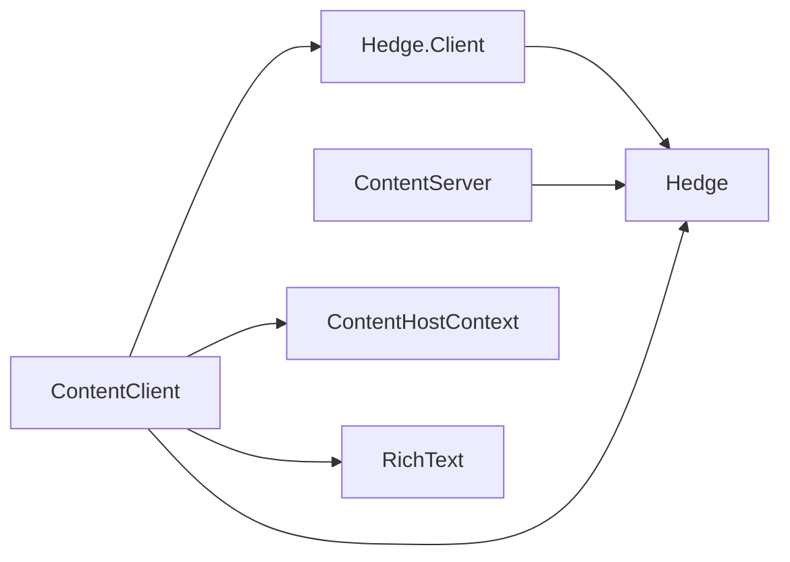

# Architectural Refactor Plan: Hedge Boundaries & Contracts

**Baseline:** local `main` at `c8c011c` (OIDC/email authentication merged). Recheck the implementation branch against this baseline before editing shared auth files.  
**Status:** Implementation work order, incorporating both architectural reviews.  
**Updated:** 2 October 2026.  
**Companion documents:** [README](../README.md), [MONOREPO](MONOREPO.md), [MODULES](MODULES.md), [UNIFIED-SHELL](UNIFIED-SHELL.md), [framework boundary refactor](HEDGE-boundary-refactor.md), [email hardening follow-ups](AUTH-email-hardening-todos.md).

## 1. Purpose, ownership and scope

Hedge projects F# models and API contracts into schemas, codecs, clients, routing and admin descriptors. This work makes three existing boundaries explicit:

1. Identity and mobile JSON operations acquire declared, checked HTTP contracts.
2. Each host registers its public admin resources and operation ceilings explicitly.
3. Shared F# runtime and presentation code acquires a compiler-enforced assembly dependency graph.

**The governing principle is explicit contracts and correct ownership.** Persistence records are not automatically public DTOs; schema generation is not authorization; an HTTP adapter need not be generated CRUD.

### Existing facilities and non-goals

- Request-context support, `AdminTable.SupportedOps`, credential-change events and browser/native transports already exist on the baseline. Preserve them; do not re-merge their historical implementation branch.
- Keep existing `{ "identity": true, ... }` storage slices. They are thin configuration shorthand over the root schema slice, also used for grants and mobile storage. Removing or renaming that manifest format is **not** an objective.
- No database migrations or changes to tables, columns, indexes, foreign keys or storage opt-ins. New API manifests must contribute **zero** domain tables.
- Preserve existing public paths, methods, request bodies (including absent bodies), response projections, authorization decisions and renewal-cookie behaviour, except for the admin restrictions explicitly listed in Track 1 and the bounded JSON request handling in Track 2.
- Framework-owned `/api/auth/me`, `/api/auth/providers`, logout, provider login/callback and `/api/auth/email*` stay framework-owned and are **out of scope for migration**. This does not prohibit typed contracts for framework JSON endpoints in future. OAuth callbacks remain protocol adapters.
- Keep OAuth, email and native session security fixes separate from this structural work. Retain their regression tests. The merged email implementation and the hardening follow-ups have their own scope; this refactor is not approval of deferred security work.
- Defer tenant redesign. Existing `Hedge.Tenant` configuration retains features, locale and companion URLs; rhymes/alerts do not become framework feature flags.
- No UI redesign, provider addition, dependency upgrade, deployment or remote migration.
- CSS and JavaScript asset delivery remain in the current Vite/`prep:lib` pipeline. Track 3 packages F# code; it does not move asset-copy side effects into library project builds.

## 2. Delivery tracks

Keep changes independently reviewable. Recommended landing order is Track 1, Track 2, Track 3. Track 3 has **no hard dependency** on typed endpoints and may be prepared separately once its dependency proof passes. Coordinate changes to shared project files rather than interleaving packaging and auth behaviour changes.

```mermaid
flowchart TD
    subgraph T1["Track 1: Admin exposure"]
        T1A["Inventory current resources and operations"] --> T1B["Explicit registration and documented ceilings"]
        T1B --> T1C["Default and idealist authorization checks"]
    end
    subgraph T2["Track 2: Identity and mobile contracts"]
        T2A["Prove discovery, dispatch, codecs and parameterless POST"] --> T2B["Migrate identity endpoints"]
        T2B --> T2C["Migrate mobile JSON endpoints"]
        T2C --> T2D["Verify legacy clients and retained adapters"]
    end
    subgraph T3["Track 3: Library packaging"]
        T3A["Prove concrete dependency graph"] --> T3B["Package libraries with their consumers"]
        T3B --> T3C["Check all hosts, fixtures and delivered assets"]
    end
```



Every landing must build and pass the affected gates. Package a library and migrate its consumers together where separating them would leave incompatible type identities or broken includes. Do not use a green compilation as evidence that routes or permissions still exist.

## 3. Track 1: Explicit admin exposure

### 1.1 Exposure matrix and deliberate policy changes

These are the **existing public resource names**, not new names. Preserve the corresponding `/api/admin/<resource>` paths.

| Composition | Resource / descriptor | Owner operations | Curator operations | Policy change |
| :--- | :--- | :--- | :--- | :--- |
| Default and idealist | `Item` / `Blog.AdminGen.item` | Full CRUD | None | None |
| Default and idealist | `Tag` / `Blog.AdminGen.tag` | Full CRUD | None | None |
| Default and idealist | `ItemTag` / `Blog.AdminGen.itemTag` | Full CRUD | None | None |
| Default and idealist | `ItemComment` / `Blog.AdminGen.itemComment` | List, Read, Update, Delete | None | Remove manual comment creation |
| Default and idealist | `ItemSnapshot` / `Blog.AdminGen.itemSnapshot` | List, Read, Delete | None | Remove Create and Update |
| Default and idealist | `Identity` / `Server.AdminGen.identity` | List, Read | None | Remove Create, Update and Delete, including direct display-name edits |
| Default and idealist | `Grant` / `Server.AdminGen.grant` | Full CRUD | None | None; owner role assignment retained |
| All applicable compositions | `Guest` | Not registered | Not registered | Remove generic guest-row administration |
| Where storage exists | `MobileSession`, `MobileAuthCode` | Not registered | Not registered | Already private; remain private |
| Idealist only | `AlertSource` / `Alerts.AdminGen.alertSource` | Full CRUD | List, Read | None |
| Idealist only | `PendingPost` / `Alerts.AdminGen.pendingPost` | Full CRUD | List, Read | None |
| Idealist only | `Promotion` / `Alerts.AdminGen.promotion` | Full CRUD | List, Read | None |

Full CRUD means `OpList; OpRead; OpCreate; OpUpdate; OpDelete`. A registered resource without permission retains current 401/403 behaviour; an unregistered resource returns 404 and is absent from discovery.

Keep the allowlist conversion distinguishable from policy tightening in the commits. Audit repository callers/scripts for the operations being removed, and record any operational dependency found. Do not silently remove a required workflow or expand this refactor into new profile-editing/moderation UI. The four restrictions above must be visible in the implementation description and acceptance tests.

### 1.2 Composition-specific registration

Create a common registry after the generated descriptors are available:

```fsharp
// Server/AdminTablesCommon.fs
module Server.AdminTablesCommon

open Hedge.Admin

let tables : AdminTable list = [
    Blog.AdminGen.item
    Blog.AdminGen.tag
    Blog.AdminGen.itemTag
    { Blog.AdminGen.itemComment with
        SupportedOps = [ OpList; OpRead; OpUpdate; OpDelete ] }
    { Blog.AdminGen.itemSnapshot with
        SupportedOps = [ OpList; OpRead; OpDelete ] }
    { Server.AdminGen.identity with
        SupportedOps = [ OpList; OpRead ] }
    Server.AdminGen.grant
]
```

Select one small registry using the existing MSBuild composition mechanism:

```fsharp
// Server/AdminTables.fs — default
module Server.AdminTables
let tables = Server.AdminTablesCommon.tables
```

```fsharp
// Server/AdminTables.idealist.fs — idealist
module Server.AdminTables
let tables =
    Server.AdminTablesCommon.tables @ [
        Alerts.AdminGen.alertSource
        Alerts.AdminGen.pendingPost
        Alerts.AdminGen.promotion
    ]
```

In `Server.fsproj`, after the selected generated `AdminGen` file and before `AdminConfig.fs`:

```xml
<Compile Include="AdminTablesCommon.fs" />
<Compile Include="AdminTables.fs" Condition="'$(HEDGE_SITE)' != 'idealist'" />
<Compile Include="AdminTables.idealist.fs" Condition="'$(HEDGE_SITE)' == 'idealist'" />
```

Set `AdminConfig.Tables = Server.AdminTables.tables`. Keep the existing authorization function and curator permission matrix. `HEDGE_SITE` does not currently define an F# `IDEALIST` symbol; do not use an unwired `#if IDEALIST`.

Descriptor ceilings apply even to `AdminOwner`. Curator writes continue through the alerts workflow endpoints; generic CRUD must not bypass those state transitions.

### 1.3 Documentation and deferred work

Update `notes/MODULES.md` and the module-authoring checklist during implementation: generating/composing a table does not expose it in admin. The host must register a descriptor, choose its operation ceiling and provide caller permissions.

Delegated permissions still use resource-name strings such as `curatorReadable`. Replacing that policy vocabulary is deferred. Do not rename resources during this work.

## 4. Track 2: Compatible identity and mobile contracts

### 2.1 Registration strategy: API surfaces alongside unchanged storage

Retain all existing storage entries in every `gen-modules*.json`, including their assembly, namespace and ordering. Add separate module references for HTTP surfaces. Use distinct API namespaces to avoid colliding with the existing handwritten `Identity.Db` and to avoid discovering mobile endpoints twice through the existing `Mobile` storage slice.

| HTTP surface | API declaration | Assembly containing it | Manifest / generated surface | Prefix |
| :--- | :--- | :--- | :--- | :--- |
| Identity lifecycle | `IdentityHttp.Api` in `identity/src/Models/Api.fs` | Existing `IdentityModels` | `packages/modules/identity/http/module.json`, sibling `generated/` | `/api/auth` |
| Mobile sessions | `MobileHttp.Api` in `identity/src/Mobile/Api.fs` | Existing `MobileModels` | `packages/modules/identity/mobile-http/module.json`, sibling `generated/` | `/api/mobile` |

These namespaces contain APIs, **no Domain records**. Existing storage namespaces remain `Models.Domain`, `Grants.Domain` and `Mobile.Domain`.

For example, the identity HTTP manifest is:

```json
{
  "assembly": "IdentityModels",
  "namespace": "IdentityHttp",
  "tablePrefix": "",
  "routePrefix": "/api/auth",
  "handlerNs": "IdentityHttp.Handlers",
  "namePrefix": "identityHttp"
}
```

The mobile HTTP manifest uses `MobileModels`, `MobileHttp`, `/api/mobile`, `MobileHttp.Handlers`, and `mobileHttp` respectively. Add host manifest entries using paths relative to the host, such as `{ "module": "../../packages/modules/identity/http" }`.

Identity-only hosts must not acquire grants or mobile tables/dependencies. Add the mobile HTTP surface only where the host composes mobile storage and explicitly supports those endpoints. Inventory the baseline's routes and storage together; record any mismatch rather than accidentally exposing mobile routes in a non-mobile deployment.

Emit module-owned Codecs, ClientGen and RouteContract files; bind dependencies through the host's composition. Empty generated Db/Admin surfaces must compile and contribute no resources. Prove this API-only composition in 2A; if an emitter assumes non-empty domain types, make the smallest generic correction there, not a new identity special case.

Wire project references and module props for models/codecs/server/client artifacts in every affected host and fixture. Bind identity operations over the existing identity dependencies. Mobile bindings retain host policy for attribution, session lifetime and native return addresses; generated contracts never depend on app `Env`.

### 2.2 Discovery rules and the mandatory 2A proof

One endpoint module contains **one property named exactly `endpoint`**. JSON-body POST endpoints require actual nested `Request` and `Response` records. Do not use aliases in place of reflection-discovered records or introduce multiple endpoint properties within one module.

Gen replaces the initial `/api` with a module's route prefix. All examples below use module-relative declarations: `/api/activate` with `/api/auth` becomes `/api/auth/activate`, exactly once.

**Parameterless POST decision:** add a narrow `PostEmpty<'Response>` declaration to `Hedge.Interface` and support it through discovery, codecs, client generation, route contracts and handler generation. It has a nested `Response`, no request DTO, a unit client argument and `Body = None`. With request context enabled, its handler receives unit, request and execution context. Dispatch must **not read or JSON-decode the body**. Existing callers sending either no body or `{}` remain valid. Do not substitute a fake `Unused` field or bare `Post<unit, Response>`.

Extend `test/BoundaryFixtures` before migrating production routes. The proof must:

- Assert the exact discovered/generated endpoint set, paths and methods, including both activate and revert. An empty or partial route set is a failure.
- Dispatch legacy requests through generated routing and assert the intended handler was called with the decoded target and merge flag. Compilation or searching generated text alone is insufficient.
- Exercise parameterless POST with absent body and `{}`, and verify no body-read occurs. Exercise the generated client and assert it emits the correct method/path with no body.
- Round-trip nested DTOs, optional fields and response projections. Check existing client decoders against generated responses, including absent/null optional values; preserve compatibility rather than exposing persistence records.
- Exercise both a standalone fixture and the composed, API-only module surface. Assert that storage/schema output is unchanged.
- Check denied and malformed requests through the complete preflight-to-dispatch path, including status and renewal headers.

**Narrow generator diagnostic:** fail with a useful module/property error when a supported endpoint-typed property has a name other than `endpoint`, or a module declares multiple endpoint-typed properties. Allow helper modules, shared DTO types and the existing deliberate WebSocket declaration. Do not reject every nested type lacking an endpoint. Add a negative fixture for the former `activateEndpoint`/`revertEndpoint` mistake and a positive shared-DTO fixture.

Track 2B does not start until this proof passes.

### 2.3 Identity lifecycle contracts

```fsharp
module IdentityHttp.Api

open Hedge.Interface

type IdentityListItem = {
    id: string
    provider: string
    name: string
    picture: string
    email: string option
    activatedAt: int option
}

module Activate =
    type Request = { identityId: string; merge: bool }
    type Response = { ok: bool }
    let endpoint = Post<Request, Response> "/api/activate"
    let requestContext = true

module Revert =
    type Request = { identityId: string; merge: bool }
    type Response = { ok: bool }
    let endpoint = Post<Request, Response> "/api/revert"
    let requestContext = true

module Disconnect =
    type Request = { identityId: string; name: string option }
    type Response = { ok: bool }
    let endpoint = Post<Request, Response> "/api/disconnect"
    let requestContext = true

module GetIdentities =
    type Response = { identities: IdentityListItem list }
    let endpoint = Get<Response> "/api/identities"
    let requestContext = true
```

Keep two small request records for activate/revert; map both to a shared switch implementation taking the identity ID and merge choice. Duplicating these wire records does not require duplicating account-switch policy.

Preserve:

- Ownership checks, identity selection, merge/fresh attribution choices and host-provided reassign statements.
- Disconnect's optional fallback name (missing/empty means `Anonymous`) and the existing 400 for attempting to disconnect the anonymous identity.
- `GetIdentities` returning HTTP 200 with `{ "identities": [] }` for rejected credentials, without bootstrapping a session.
- The public identity projection, excluding guest ownership, provider account IDs and internal lifecycle fields.
- Renewal cookies on the same success/denial paths as the baseline. Preserve low-level response control; generated codecs do not replace HTTP status/header policy.

Keep existing browser/native callers working throughout the migration. Generated clients must compile and pass transport tests; wholesale replacement of the session-coordination JavaScript is not part of this work.

### 2.4 Mobile session contracts

```fsharp
module MobileHttp.Api

open Hedge.Interface

module Bootstrap =
    type Response = { token: string }
    let endpoint = PostEmpty<Response> "/api/bootstrap"
    let requestContext = true

module Me =
    type PublicIdentity = {
        id: string
        provider: string
        name: string
        picture: string
        email: string option
    }
    type GuestAccount = { guestId: string; identity: PublicIdentity }
    type Response = { guest: GuestAccount option }
    let endpoint = Get<Response> "/api/me"
    let requestContext = true

module Exchange =
    type Request = { code: string; verifier: string }
    type Response = { token: string }
    let endpoint = Post<Request, Response> "/api/exchange"
    let requestContext = true

module Signout =
    type Response = { ok: bool }
    let endpoint = PostEmpty<Response> "/api/signout"
    let requestContext = true
```

The existing client sends `{}` to bootstrap and **no body** to signout. Both must continue working without a mobile release. A valid anonymous bearer produces `{ "guest": null }` from `me`; missing/invalid/expired/revoked bearer produces 401. Keep those distinct.

Preserve atomic PKCE verification/consumption, wrong-verifier non-consumption, optional old-bearer attribution/rotation and signout idempotence. Do not turn the old anonymous bearer into a required login credential.

### 2.5 Authorization and body handling before generated dispatch

`requestContext = true` supplies context; it does not authorize requests. Generated JSON-body POST dispatch reads the body before calling the typed handler. Put the necessary preflight **before** that dispatch.

| Endpoint family | Required ordering and policy |
| :--- | :--- |
| Identity activate/revert/disconnect | Resolve the existing guest-or-bearer policy before reading the body. A present invalid bearer still fails closed without falling back to cookies. Then bound/decode the body; perform identity ownership checks before mutation. |
| Identity list | Preserve the existing rejected-credential 200-empty response; do not apply a blanket 401 guard. |
| Mobile bootstrap | No existing session required; ignore the body as before. |
| Mobile me | Resolve bearer and preserve the 200-anonymous versus 401-invalid distinction. |
| Mobile exchange | Bound/decode the JSON request, then authenticate using the code and PKCE verifier before attribution changes. The optional old bearer identifies content to merge, not permission to sign in. |
| Mobile signout | Read/revoke the presented bearer; keep repeated, missing and already-revoked-token requests idempotent. No body read. |

Bound JSON mutation bodies to **24,000 bytes**, including requests with no `Content-Length`, before calling generated dispatch. This is an explicit request-size guard, following the existing Native Plants pattern. Return a controlled 413 on excess and 400 for malformed JSON/types. Preserve required-field checks such as empty exchange code/verifier before code consumption. Do not silently add content-type requirements that reject existing callers.

Read the stream once with a cap; reconstruct a request from the bounded bytes while preserving URL, method and headers. Do not clone/tee an unbounded input. Any resolved subject is request-local, never mutable state on shared `env` or an isolate-wide service. Preserve any replacement-cookie information across the handoff.

Keep the baseline's per-endpoint origin policy. In particular, do not introduce a blanket same-origin or browser-cookie requirement for native bearer traffic. Test native requests with their existing origin/header behaviour.

### 2.6 Retained HTTP adapters and host policy

Keep these explicit adapters, with ownership documented:

- `GET /api/mobile/return`: browser cookie authorization and redirect carrying a one-time code to the host's native return address.
- `POST /api/mobile/blobs`: bearer-aware authorization followed by the existing multipart/R2 upload handler.
- `GET /archive/<id>`: sandboxed HTML serving and its private-blob restrictions.
- `GET /api/rhymes`: existing app-specific JSON feed using blog codecs. Move it and its app SQL to `Server/Features/Rhymes.fs` if doing so clarifies the host binder; its wire shape and ownership remain unchanged.
- Framework auth endpoints listed in §1: no migration in this work.

Generated dispatch replaces only the explicitly migrated paths. Remove obsolete matches individually, not the whole current `authRoutes` function.

## 5. Track 3: Concrete library packaging

### 3.1 Decision and dependencies

Use concrete project references for the existing shared runtime and presentation code. No new `ISessionService`/`IAuthClient` interface layer is required merely to package sibling libraries.

- `Hedge.Client` owns the existing `Client.Api`, `Client.GuestSession`, `Client.AdminCredential` implementations and session types.
- `ContentHostContext` owns the existing navigation/title contract and remains independent of React, Elmish and the browser-session runtime.
- `RichText` owns the existing F# bindings to the separately delivered JavaScript runtime.
- `ContentClient` contains identity presentation/update logic and shared comments, with explicit dependencies on those libraries.
- `ContentServer` contains the shared author-resolution contract. App-specific identity/attribution policy stays in the host.

Arrows below mean **consumer references dependency**:



`ContentHostContext` and `RichText` depend only on `Fable.Core`; neither depends on `Hedge.Client`.

### 3.2 Project specifications

Use `netstandard2.0`, matching existing consumers, and existing package versions. Paths below are relative to the new project file.

| New project | Sources, in compile order | Project references | Package dependencies |
| :--- | :--- | :--- | :--- |
| `packages/hedge/src/Client/Hedge.Client.fsproj` | `AdminCredential.fs`, `Api.fs`, `GuestSession.fs` | `../Hedge/Hedge.fsproj` | Fable.Core, Fable.Promise, Thoth.Json, Thoth.Fetch |
| `packages/rich-text/RichText.fsproj` | `RichText.fs` | None | Fable.Core |
| `packages/content-client/ContentHostContext.fsproj` | `HostContext.fs` | None | Fable.Core |
| `packages/content-client/ContentClient.fsproj` | `ClaimGlue.fs`, `Identity.fs`, `IdentityView.fs`, `Comments.fs` | `ContentHostContext.fsproj`, `../rich-text/RichText.fsproj`, `../hedge/src/Client/Hedge.Client.fsproj`, `../hedge/src/Hedge/Hedge.fsproj` | Fable.Core, Fable.Browser.Dom, Feliz, Fable.Elmish, Thoth.Json, Thoth.Fetch |
| `packages/content-server/ContentServer.fsproj` | `Author.fs` | `../hedge/src/Hedge/Hedge.fsproj` | Fable.Core, Fable.Promise |

The two projects in `packages/content-client` must not share intermediate assets accidentally. Give them distinct intermediate/output paths using appropriately early MSBuild configuration, and verify clean and incremental restores/builds. This is part of the packaging proof, not a reason to move application features into the framework.

### 3.3 Migration and acceptance

1. Prove the graph with a small consuming fixture before bulk project edits. Shared types must come from a single assembly; remove their old source inclusions from each migrated consumer.
2. Update Microblog, Articles, their composed module props, generic admin/runtime consumers and all affected fixtures. Search the repository for every inclusion of these files; the named apps are not an exhaustive consumer list.
3. In module props, resolve project paths through `$(MSBuildThisFileDirectory)`, not a consuming app's working directory. Declare the libraries the module actually uses.
4. Preserve generated-code ownership from Track 2 and keep reusable libraries free of app project references and site-specific compilation flags.
5. Verify standalone and composed clients, non-browser `HostContext` probes, runtime tests and the Native Plants consumer checkout. Update source headers that still describe the files as exclusively file-linked or "not a project".
6. Verify Fable output and browser bundling as well as .NET compilation. Keep session globals/credential subscriptions single-owned and preserve editor/image behaviour.

**Accepted asset boundary:** CSS, `guest-session.js`, editor JavaScript and other assets retain their current source owners and Vite/`prep:lib` delivery. Do not add library build targets that copy into app deployment directories. Verify the emitted site still contains and loads the required files at root and under a base path; broader asset packaging is a separate follow-up.

Track 3 may be prepared independently, but it is not merely a search-and-replace: type identity, dependency direction, Fable compilation and all consumers must be checked.

## 6. Verification and handoff

### 6.1 Baseline and generation

Record the exact starting commit and pre-existing dirty files/failing checks. Do not delete unrelated local notes or generated artifacts to manufacture a clean tree.

Extend the gate to regenerate and diff-check both HTTP module surfaces and all affected host compositions. Keep the existing default-only writes for the shared storage slice: a site-specific generation pass must not overwrite the default identity/grants/mobile helpers. Compare schemas against the baseline, not just fresh versus migrated parity.

From the repository root:

```bash
./test.sh
(
    cd apps/microblog
    ./check-sql.sh
)
```

Changes to generated route/codecs/admin glue are expected and must be committed with the implementation. Unexpected schema changes, missing endpoints or unrelated generated churn fail the checkpoint. If a baseline test is already failing, report it and distinguish it from new failures.

### 6.2 Composition-safe compilation

From the repository root, after generation:

```bash
(
    cd apps/microblog

    npm run clean:site
    HEDGE_SITE= npm run build:server
    HEDGE_SITE= npm run build:client

    npm run clean:site
    HEDGE_SITE=idealist npm run build:server
    HEDGE_SITE=idealist npm run build:client

    # Mobile build:web selects the default composition again.
    npm run clean:site
    cd mobile
    HEDGE_SITE= npm run build:web
)
```

Also compile the affected Articles compositions, generic admin, module/assembly fixtures and Native Plants integration using their existing build procedures. Check both clean and incremental builds after packaging. Keep the existing Fable composition-cache regression gate.

### 6.3 Behavioural acceptance

- [ ] **Route inventory:** both identity mutation aliases, disconnect/list and all four mobile JSON operations dispatch exactly once at their existing URLs. Wrong methods/unknown paths do not invoke mutations.
- [ ] **Legacy mobile requests:** bootstrap with `{}`, signout with no body, and generated parameterless clients work without a new mobile release.
- [ ] **Identity switching:** activate and revert preserve target identity, ownership checks and merge/fresh choices. Cross-guest targets are rejected.
- [ ] **Disconnect:** missing/empty fallback name works; anonymous disconnect remains 400.
- [ ] **Identity list:** rejected credentials still receive 200-empty; no internal fields are exposed.
- [ ] **Preflight:** unauthenticated identity mutations are denied before body consumption; oversized streamed JSON is bounded; malformed/invalid requests cannot mutate accounts or consume PKCE codes.
- [ ] **Credential semantics:** invalid bearer does not fall back to a valid cookie; native origins remain supported; relevant renewal cookies survive dispatch and decoding.
- [ ] **Native lifecycle:** anonymous and verified `me` responses remain distinct from 401; bad PKCE proof does not burn a code; a successful exchange cannot be replayed; old-bearer handling and revocation survive races; signout remains idempotent.
- [ ] **Retained adapters:** native return, photo upload, archive CSP/private blobs and rhymes still work.
- [ ] **Existing login regression:** configured Google, GitHub, Microsoft, LinkedIn and email flows retain the merged baseline's behaviour. Retain account-linking security fixtures; do not fold email-hardening follow-ups into this refactor.
- [ ] **Admin policy changes:** owner comment creation and snapshot creation/update are blocked; remaining comment/snapshot operations work. Identity is read-only, Guest omitted. Check owner operations used by existing scripts/workflows.
- [ ] **Admin continuity:** Item, Tag, ItemTag and Grant retain owner CRUD; grants can still assign/revoke roles; idealist retains owner alerts CRUD and curator read-only visibility. Curator workflow writes still use alerts endpoints.
- [ ] **Private resources:** Guest and mobile internals are absent from discovery and return 404, including for the owner. Unregistered new resources stay private by default.
- [ ] **Other hosts:** Articles and Native Plants do not acquire unwanted identity capabilities, tables or admin resources.
- [ ] **Presentation/assets:** identity controls, comments, editor, photographs and session runtime load correctly at root and under a deployment base path.
- [ ] **Schema invariance:** tables, columns, indexes, foreign keys and opt-in compositions match the baseline.
- [ ] **Documentation:** module-authoring guidance covers explicit admin registration; source headers and dependency diagrams match the final assembly graph.

Deliver each track with its actual file/assembly ownership, intentional policy changes, generated artifacts and test evidence. This document defines the implementation handoff; deployment and remote data changes are not part of the refactor.
